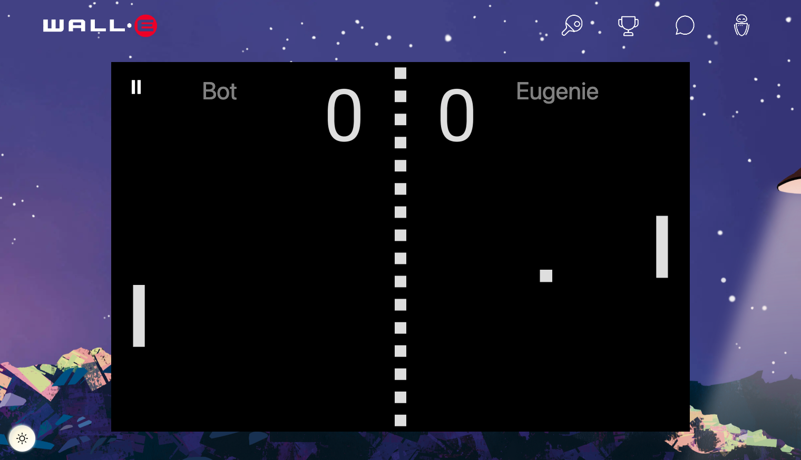

# ft_transcendence

Link to group repository : [ft_transcendence](https://github.com/the-5-pong-heroes/transcendence)

This is a full-stack web application developed using Nest.js and React. It provides a platform for users to engage in various activities such as chatting, playing multiplayer Pong games, connecting with friends, exploring rankings, and managing profiles.

 

## Features

- **Chat**: Communicate with other users through public, private, and protected channels.
- **Leaderboard**: View and track the rankings of players.
- **Multiplayer Pong Game**: Engage in a competitive multiplayer Pong game.
- **Profile Accounts**: Manage and customize user profiles.
- **Settings**: Configure and update user account settings.
- **Login**: Register with your 42 account, Google account, or create an account using your email.

 

    
    

 

## Technologies Used

The application is built using the following technologies:

- **Backend**: Nest.js, TypeScript, Prisma, PostgreSQL
- **Frontend**: React, TypeScript, React Router, React Three Fiber
- **Authentication**: JWT (JSON Web Tokens), OAuth (42 Login, Google Login)
- **Websockets**: Socket.IO for real-time communication

 

    
    

 

## Usage

To run the application locally, follow these steps:

1. Clone the repository: `git clone git@github.com:EugenieF/42_ft_transcendence.git`
2. Navigate to the project directory: `cd 42_ft_transcendence`
3. Build the project using the 'make' command.
4. Access the application in your browser at `http://localhost:5173`.

Make sure you have the necessary software and tools installed, such as Docker and docker compose, before running the application.

 

    

 

    

 
